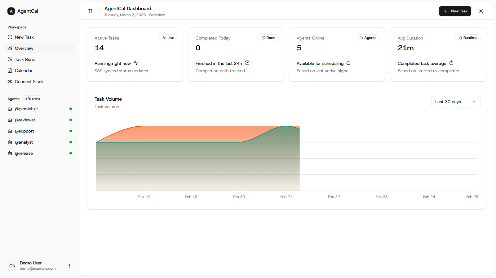
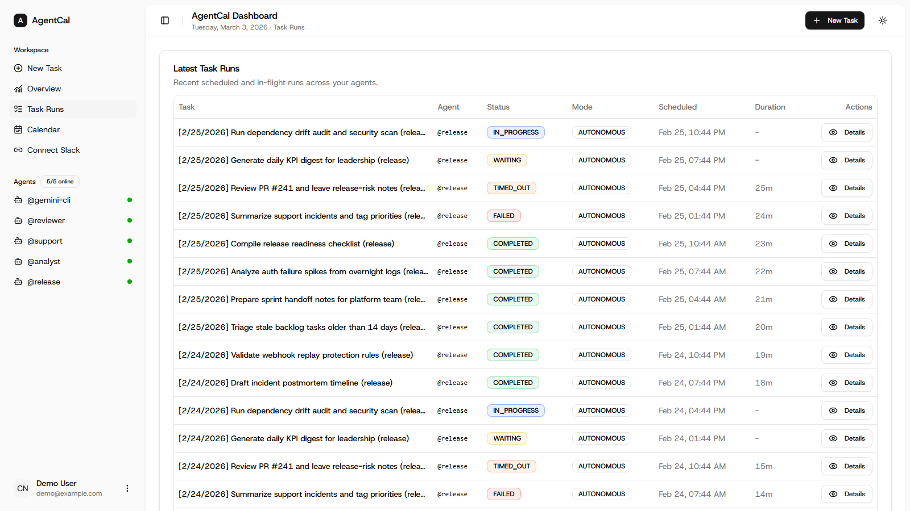
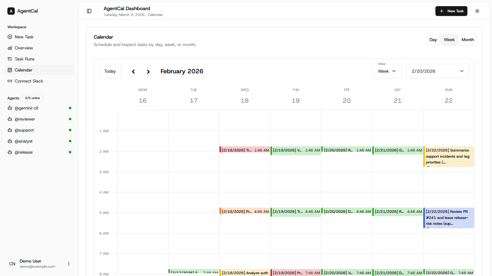

# Kronos

Kronos is a scheduler/orchestration dashboard for running agent tasks through ACP with the `kronos` bridge CLI.

## Implemented Features

| Area | Feature | Status | Notes |
|---|---|---|---|
| Scheduling | Agent task scheduling from dashboard | Implemented | Create tasks with schedule, mode, timeout, and optional Slack channel |
| Lifecycle | Task state tracking (`SCHEDULED -> DISPATCHED -> IN_PROGRESS -> terminal`) | Implemented | Lifecycle synced through ACP event ingestion |
| Queue Delivery | Streamable HTTP queue for workers | Implemented | `watch-queue` consumes `/api/bridge/tasks` by default |
| Queue Delivery | Polling queue fallback | Implemented | `--queue-transport polling --poll-ms <n>` |
| CLI Bridge | ACP stdio bridge and driven ACP mode | Implemented | `watch-stdio` and `watch-stdio --drive-acp` |
| Mentions (UI) | `@` file autocomplete in New Task description | Implemented | Project-file suggestions from authenticated API |
| Mentions (CLI) | Prompt mention preprocessing for `@...` paths | Implemented | Enabled by default, disable via `--no-mention-preprocess` |
| Auth | Bridge token minting + alias-scoped worker auth | Implemented | Tokens issued via `/api/bridge/token` |
| Observability | Real-time dashboard event stream | Implemented | SSE endpoint for task updates |
| Observability | ACP session title display | Implemented | Automatically display agent-generated session title in place of task prompt in task lists and calendar views |

## Coming Soon

| Area | Feature | Status | Notes |
|---|---|---|---|
| Worker Safety | Cross-process dedupe/lease locking for same alias | Coming Soon | Prevent duplicate execution across multiple watcher processes |
| Mentions (UX) | Rich mention picker UI (grouping, fuzzy ranking, keyboard hints) | Coming Soon | Improve discovery in long repos |
| Queue Control | Per-agent concurrency limits and rate shaping | Coming Soon | Better control for provider/API limits |
| Reliability | Dead-letter/retry policies for failed queue deliveries | Coming Soon | Safer recovery for transient failures |
| Telemetry | Worker/session analytics and throughput dashboards | Coming Soon | Visibility into queue lag, run time, and failures |

## Setup

```powershell
npm i
npm run db:push
npm run dev
```

Open `http://localhost:3737/login` (default port `3737`), register an account, and sign in.

## Dashboard Preview

### Overview (Light Mode)


### Task Runs (Light Mode)


### Calendar (Light Mode)


## Real App Workflow

1. Open `http://localhost:3737/dashboard`.
2. Register an agent alias in **Settings** (e.g. `oc`).
3. Under **Bridge Tokens**, generate a token and copy it.
4. Run the interactive TUI setup wizard:

```powershell
npm run kronos setup
```
The wizard will guide you to save the token and select your agent configuration.

5. Boot the server and your agent in one command:

```powershell
npm run kronos up -- --alias oc --verbose
```
*(If you compiled the binary, you can run `./kronos setup` and `./kronos up` directly!)*

6. Back in the dashboard, create a new task assigned to `@oc`.
   - In **Task Description**, type `@` to autocomplete project file paths.
7. Task status flows in UI as lifecycle events arrive (`SCHEDULED` -> `DISPATCHED` -> `IN_PROGRESS` -> terminal status).

## ACP Notes

- `kronos up` / `kronos agent` continuously picks active tasks for the alias and forwards ACP lifecycle events to `/api/acp/events`.
- Streamable HTTP queue delivery is used by default (`GET /api/bridge/tasks`).
- Use `--queue-transport polling --poll-ms 3000` to force legacy polling mode.
- Keep the watcher terminal running while tasks are being processed.
- Use `watch-stdio` only if you are wiring your own ACP NDJSON stream manually.
- `watch-queue` / `watch-stdio --drive-acp` preprocess `@...` mentions in prompt text and resolve to project files (`--no-mention-preprocess` to disable).

## Useful Commands

```powershell
npm run build
npm run start
npm run db:studio
npm run kronos -- --help
```

## License

Licensed under the Apache License 2.0. See [LICENSE](LICENSE).

